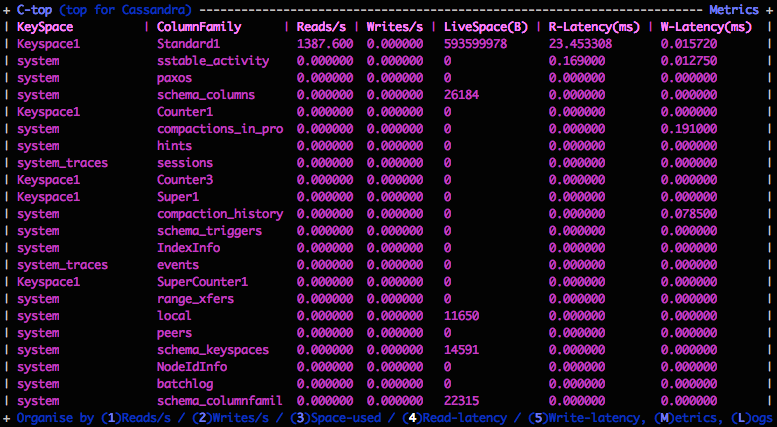
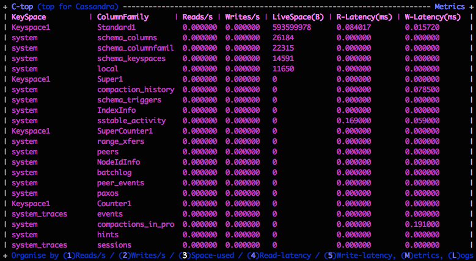
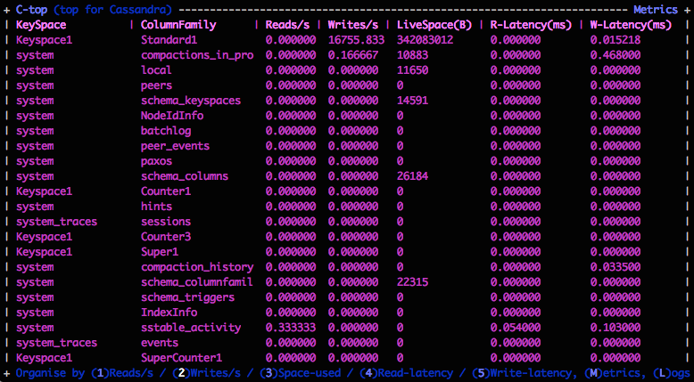

# CTOP ("Top for Cassandra")

[](https://travis-ci.org/hailocab/ctop) 

CTOP is a tool which allows you to quickly find out what's happening on a machine running Cassandra. It is particularly useful on a cluster with multiple-tenants, multiple-applications, and large numbers of tables. If you suspect that the performance is not good, then you can use this to figure out which table is giving you trouble.

## Screenshots:




## Installation (deb):
* Download a [DEB file](https://github.com/hailocab/ctop/releases/download/1.3/ctop_1.3_amd64.deb "CTOP 1.3") from the [releases](https://github.com/hailocab/ctop/releases "releases") section
* Install mx4j "apt-get install libmx4j-java"
* Install CTOP "dpkg -i ctop_1.3_amd64.deb"
* Find out what's killing your Cassandra cluster

## Installation (binary):
* Download a binary (or compile one yourself)
* Install mx4j jars in the java/cassandra classpath ([download from here](http://sourceforge.net/projects/mx4j/files/MX4J%20Binary/))
* Re-start cassandra
* Run CTOP

## How to use it:
* Run the binary
* Allow CTOP some time to collect metrics, then press SPACE to refresh the display. You will see your tables listed by Reads/s (in descending order).
* You can press SPACE at any time to refresh the display
* The numbers 1 through 5 change the sorting order:
  1: Order by Reads/s
  2: Order by Writes/s
  3: Order by the amount of disk-space used (in Bytes)
  4: Order by read-latency (in miliseconds)
  5: Order by write-latency (in miliseconds)
* Pressing "Q" will quit
* Metrics are for one node only (not cluster-wide)

## Notes
* CTOP should run on anything. Originally was developed on Ubuntu, and
  it's reported to run on CentOS and MacOS X.

## Pre-requisites:
* CTOP uses "libmx4j-java" (an HTTP -> JMX) to retrieve JMX metrics from Cassandra (there was no easy way to query JMX directly), so this needs to be in the class-path where Cassandra can find it upon startup (with Ubuntu it is enough to do "apt-get install libmx4j-java", then to re-start Cassandra).
* Cassandra needs to be told how to run MX4J (the default is to listen to the interface that Cassandra listens on):  
```
  MX4J_ADDRESS="-Dmx4jaddress=127.0.0.1"  
  MX4J_PORT="-Dmx4jport=8081"  
  JVM_OPTS="$JVM_OPTS $MX4J_ADDRESS"  
  JVM_OPTS="$JVM_OPTS $MX4J_PORT"  
```

